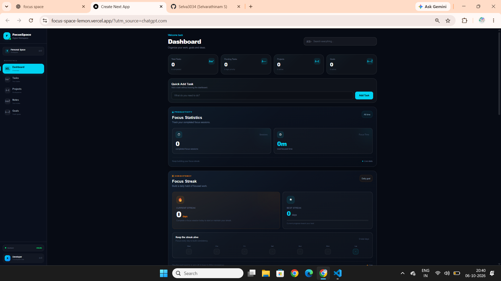
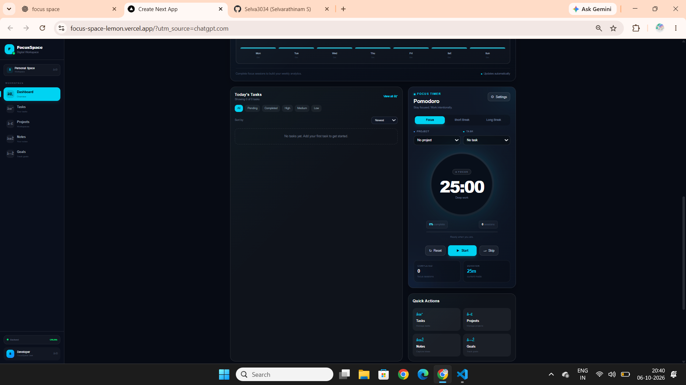
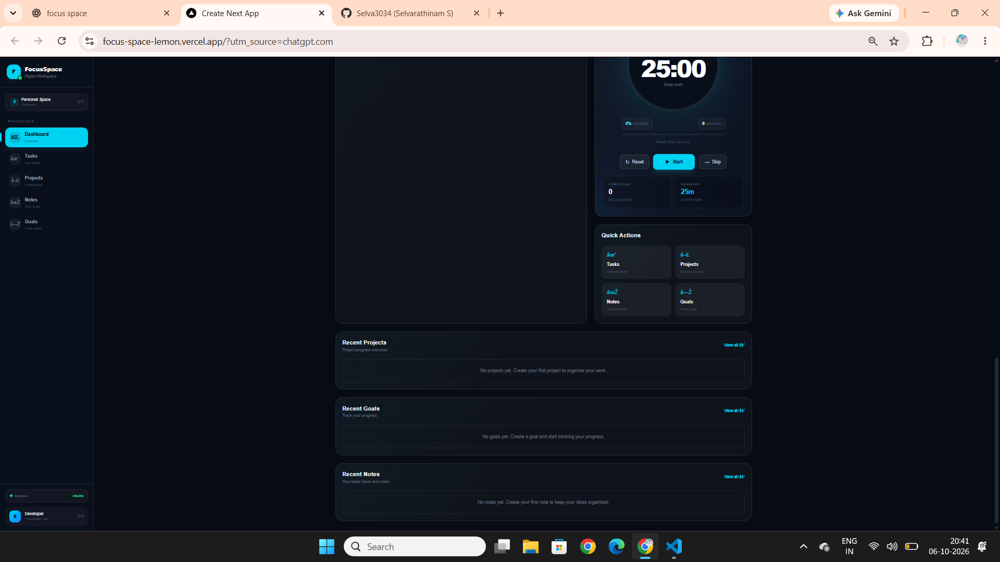

# FocusSpace — Digital Workspace

FocusSpace is a full-stack digital productivity workspace designed to help users manage tasks, projects, notes, goals, and focused work sessions from a single dashboard.

It combines task management with Pomodoro-based focus tracking, productivity analytics, and focus streak tracking.

## Live Demo

Frontend: https://focus-space-lemon.vercel.app

Backend API: https://focusspace-api.onrender.com

## Features

### Dashboard
- Productivity overview
- Total tasks
- Pending tasks
- Projects
- Goals
- Quick task creation
- Backend connection status

### Task Management
- Create tasks
- Complete/uncomplete tasks
- Delete tasks
- Task categories
- Task priorities
- Assign tasks to projects
- Task filtering and sorting

### Project Management
- Create projects
- Edit projects
- Delete projects
- Project descriptions
- Project status
- Project progress tracking
- Project task statistics

### Notes
- Create notes
- Edit notes
- Delete notes
- Search notes
- Assign notes to projects
- Project-specific notes

### Goals
- Create goals
- Edit goals
- Delete goals
- Goal categories
- Target dates
- Progress tracking
- Active, completed, and paused states

### Pomodoro Focus Timer
- Focus mode
- Short break
- Long break
- Custom timer durations
- Start/pause/reset controls
- Skip session
- Task selection
- Project selection
- Automatic focus session tracking

### Productivity Analytics
- Total focus sessions
- Total focused time
- Weekly focus analytics
- Daily focus activity
- Average focus time
- Focus streak tracking
- Best streak tracking
- Current streak tracking

## Tech Stack

### Frontend

- Next.js
- React
- TypeScript
- Tailwind CSS

### Backend

- Python
- FastAPI
- SQLAlchemy
- Pydantic
- Uvicorn

### Database

- SQLite

### Deployment

- Vercel — Frontend
- Render — Backend

### Development Tools

- Visual Studio Code
- Git
- GitHub
- Swagger UI

## Architecture

```text
                    FocusSpace
                        |
          +-------------+-------------+
          |                           |
      Frontend                    Backend
      Next.js                     FastAPI
          |                           |
          |       REST API            |
          +----------->--------------+
                                      |
                                  SQLAlchemy
                                      |
                                   SQLite

## Screenshots

### Dashboard



### Focus Streak



### Pomodoro Timer

